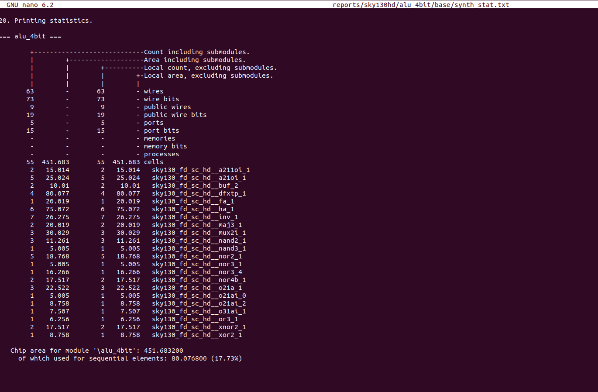
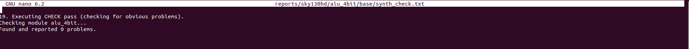

# 🚀 RTL to GDSII Flow using OpenROAD – 4-bit ALU

## 📌 Overview

This project demonstrates a complete **RTL-to-GDSII physical design flow** for a **4-bit ALU** using open-source VLSI tools.

The objective is to understand and implement each stage of the ASIC design flow:

* RTL Design
* Functional Simulation
* Logic Synthesis
* Floorplanning
* Placement
* Clock Tree Synthesis (CTS)
* Routing
* Physical Verification
* GDSII Generation

---

## 🧠 Tools Used

* **Icarus Verilog (iverilog)** → Simulation
* **GTKWave** → Waveform viewing
* **Yosys** → Synthesis
* **OpenROAD Flow** → Physical Design (RTL → GDSII)
* **Sky130 PDK** → Technology library

---

## 📁 Project Structure

```
rtl-gdsii-alu4bit/
├── rtl/                # RTL design files
├── sim/                # Testbench & simulation outputs
├── images/             # Screenshots (waveforms, layout)
├── README.md
└── .gitignore
```

---

# ⚙️ Step-by-Step Flow

---

## 🔹 Step 1: RTL Design

📄 File: `rtl/alu_4bit.v`

Design of a 4-bit ALU supporting operations like:

* Addition
* Subtraction
* AND, OR, XOR

---

## 🔹 Step 2: Simulation

### ▶ Compile

```
iverilog -o alu_sim rtl/alu_4bit.v sim/tb_alu_4bit.v
```

👉 Converts Verilog into executable simulation file

### ▶ Run Simulation

```
vvp alu_sim
```

👉 Executes testbench and generates waveform file (`dump.vcd`)

### ▶ View Waveform

```
gtkwave dump.vcd
```

👉 Opens waveform viewer to verify functionality

---

## 📊 Simulation Result


---

## 🔹 Step 3: Synthesis (Yosys via OpenROAD)

# 🔹 RTL Synthesis using OpenROAD Flow

## 📌 Synthesis Command

```bash
make DESIGN_CONFIG=designs/sky130hd/alu_4bit/config.mk synth
```

### 🧠 What this does
- Converts RTL Verilog into gate-level netlist
- Uses Yosys synthesis engine internally
- Maps logic into Sky130 standard cells
- Generates synthesis reports and metrics

---

# 📊 Synthesis Results

| Parameter | Value |
|-----------|-------|
| Total Cells | 55 |
| Chip Area | 451.683 µm² |
| Sequential Area | 17.73% |
| Errors | 0 |

---

# 🔍 Hardware Mapping Observed

The synthesized ALU consists of:

- Full Adders
- Half Adders
- XOR Gates
- NAND Gates
- NOR Gates
- Multiplexers
- Flip-Flops

This confirms successful arithmetic and logic mapping into Sky130 standard cells.

---

# 📂 Generated Reports

| Report File | Description |
|-------------|-------------|
| synth_stat.txt | Cell count, area, and hardware mapping |
| synth_check.txt | Verifies synthesis integrity |

---

# 📸 Synthesis Screenshots

## Terminal Output


## Synthesis Statistics


## Synthesis Check


## 🔹 Step 4: Floorplanning

```
make DESIGN_CONFIG=designs/sky130hd/alu_4bit/config.mk floorplan
```

👉 Defines chip area, IO placement, and power distribution

---

## 🔹 Step 5: Placement

```
make DESIGN_CONFIG=designs/sky130hd/alu_4bit/config.mk place
```

👉 Places standard cells optimally inside core area

---

## 🔹 Step 6: Clock Tree Synthesis (CTS)

```
make DESIGN_CONFIG=designs/sky130hd/alu_4bit/config.mk cts
```

👉 Builds clock network to minimize skew and delay

---

## 🔹 Step 7: Routing

```
make DESIGN_CONFIG=designs/sky130hd/alu_4bit/config.mk route
```

👉 Connects all components using metal layers

---

## 🔹 Step 8: Final GDSII Generation

```
make DESIGN_CONFIG=designs/sky130hd/alu_4bit/config.mk final
```

👉 Generates final chip layout (GDSII)

---

## 🧾 Final Reports

Available in:

```
reports/sky130hd/alu_4bit/base/
```

Includes:

* Timing reports
* DRC reports
* Congestion analysis
* IR drop analysis

---

## 📊 Results (Preliminary)

| Parameter          | Value      |
| ------------------ | ---------- |
| Total Cells        | 55         |
| Area               | 451.68 µm² |
| Utilization        | 11%        |
| DRC Violations     | 0          |
| Antenna Violations | 0          |

⚠️ These values will be updated after full analysis.

---

## 📸 Physical Design Outputs

### Placement


### Routing


---

## 🎯 Key Learnings

* Complete ASIC design flow understanding
* Hands-on with OpenROAD toolchain
* Reading synthesis and routing reports
* Debugging physical design issues

---

## 🚀 Future Improvements

* Add pipeline architecture
* Optimize timing performance
* Add power analysis
* Explore larger designs (RISC-V core)

---

## 🛠️ Installation Guide (Coming Soon)

A complete step-by-step installation guide for:

* OpenROAD
* Sky130 PDK
* Dependencies

---

## 👨‍💻 Author

**Navin Raj A**
Electronics Engineer | VLSI Enthusiast

---

## ⭐ If you like this project, give it a star!
