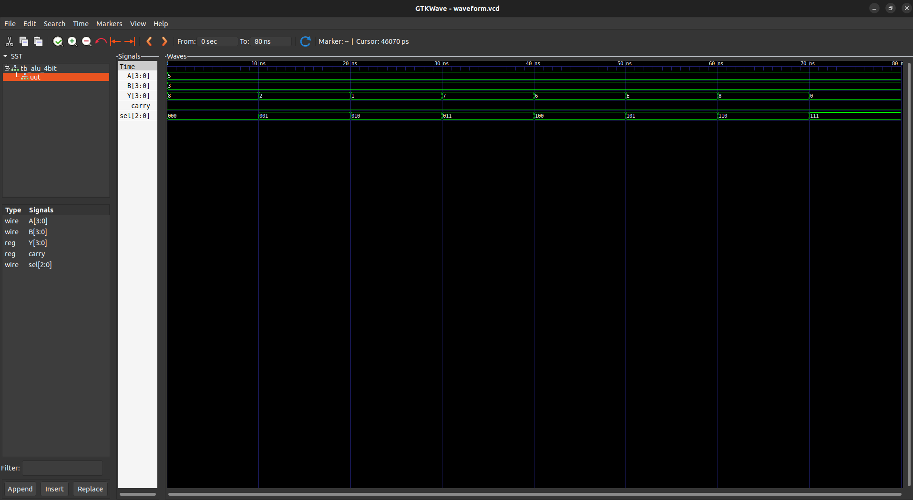

# 🔷 4-bit ALU | RTL to GDSII using OpenROAD

## 📌 Overview
This project demonstrates the complete RTL-to-GDSII flow for a 4-bit Arithmetic Logic Unit (ALU) using open-source VLSI tools.

The design is written in Verilog, verified through simulation, and implemented physically using the OpenROAD flow with Sky130 technology. The final output is a GDSII layout representing the chip design.

---

## ⚙️ Tools Used
- Verilog (RTL Design)
- Icarus Verilog (iverilog) – Simulation
- GTKWave – Waveform Viewer
- OpenROAD-flow-scripts – Physical Design Flow
- Sky130 PDK – Standard Cell Library

---

## 🔁 Complete Design Flow

1. RTL Design (Verilog)
2. Functional Simulation
3. Logic Synthesis (Yosys)
4. Floorplanning
5. Placement
6. Clock Tree Synthesis (CTS)
7. Routing
8. Physical Verification (DRC & Antenna Check)
9. GDSII Generation

---

## 📊 Results

| Parameter            | Value          |
|---------------------|---------------|
| Total Cells         | 55            |
| Area                | 451.68 µm²    |
| Utilization         | 11%           |
| DRC Violations      | 0             |
| Antenna Violations  | 0             |

---

## 📁 Project Structure
rtl/ → Verilog design files
sim/ → Testbench and simulation files
images/ → Layout screenshots
---

## 🧪 Simulation



### Compile
```bash
iverilog -o alu_sim rtl/alu_4bit.v sim/tb_alu_4bit.v
Run Simulation
vvp alu_sim
View Waveform
gtkwave dump.vcd

